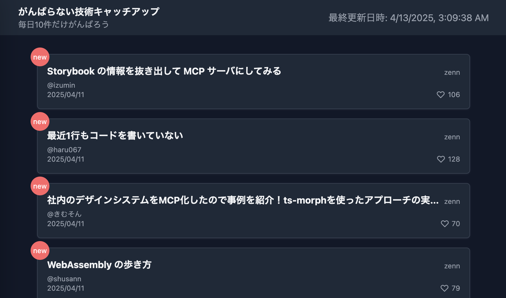

# がんばらない技術キャッチアップ

https://morimorig3.github.io/recent-developments-dashboard/

技術キャッチアップが苦手な人向けに作ってみたアプリケーション

- 件数を少なくしたい
- それでも質の高いものだけをみたい

というわがままな要望を叶えるために作成

# 仕様

- QiitaとZennの良さそうな記事をまとめて表示してくれます（最大10件！）
- 一度読んだ記事からはnewアイコンが消えてくれる（newがついてるやつだけポチッとしておけばいい！）
- 毎朝4時に自動デプロイで情報が更新される

## Qiita

過去1週間で10ストックされた記事を若い順に5件

`https://qiita.com/api/v2/items?page=1&per_page=100&query=created:>${oneWeekAgo}+stocks:>10`

ページングはしていない

## Zenn

トレンドの上位10件

`https://zenn.dev/api/articles`

現時点ではトレンドが帰ってきてそうだった

API仕様書は公開されていないので、正確ではないし変更される可能性がある

# やってみたこと

- Astro使用してみた
- ほぼAIにコーディングしてもらいました（Cursorエディター）

ほぼAIのレビューしてるだけだったのでタイピング量かなり減って時代を感じた

平気で正しそうな嘘コード作ってくるので面倒見てあげる必要はある

無理させすぎない方がいい回答出してくれる